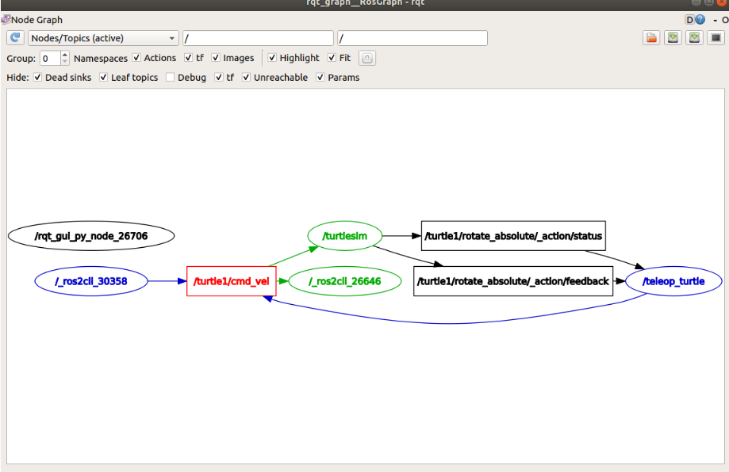

##  Comandos útiles para Tópicos y Visualización en ROS 2

| Función / Qué hace | Comando (CLI / GUI) |
|-------------------|---------------------|
| Listar todos los tópicos activos | `ros2 topic list` |
| Listar tópicos con su tipo de mensaje | `ros2 topic list -t`|
| Ver mensajes en tiempo real que pasan por un tópico | `ros2 topic echo /nombre_tópico` |
| Mostrar información sobre un tópico (tipo de mensaje, publicadores, suscriptores) | `ros2 topic info /nombre_tópico` |
| Publicar manualmente un mensaje en un tópico (útil para pruebas o debug) | `ros2 topic pub /nombre_tópico TipoDeMensaje '{...}'`|
| Publicar un mensaje una sola vez (modo “uno-shot”) | `ros2 topic pub --once /nombre_tópico TipoDeMensaje '{...}'`  |
| Visualizar el “grafo ROS” — nodos, tópicos y conexiones — de forma gráfica | Ejecutar `rqt_graph` (o abrir `rqt` → *Plugins → Introspection → Node Graph*)  |

## EJEMPLOS

Vamos a lanzar una simulación, controlar la tortuga con el teclado y ver todo esto de manera grafica.

```bash
#Terminal 1
ros2 run turtlesim turtlesim_node
```

```bash
#Terminal 2
ros2 run turtlesim turtle_teleop_key
```

```bash
#Terminal 3
rqt_graph
```

Con esto podrás obserbar el nodo teleop_turtle publicando al tópico /turtle1/cmd_vel, y al nodo turtlesim suscrito

---

Ahora vamos a escuchar el nodo turtlesim, para esto ocuparemos la funcion echo

```bash
#Terminal 4
ros2 topic echo /turtle1/pose
```
recuerda que /turtle1/pose lo encontrarás al ejecutar la lista de topicos

```bash
ros2 topic list
```

Ahora mientras mueves la tortuga con el teclado podras ver como se actualizan sus coordenadas y velocidades en el terminal 4

Ahora si queremos cambiar de manera manual la posicion de manera manual podemos hacerla de la siguiente manera:

```bash
ros2 topic pub --once /turtle1/cmd_vel geometry_msgs/msg/Twist "{linear: {x: 2.0, y: 0.0, z: 0.0}, angular: {x: 0.0, y: 0.0, z: 1.8}}"
```

Este comando envía un solo mensaje de tipo Twist al tópico /turtle1/cmd_vel, con velocidad lineal 2.0 y angular 1.8 
Si quisieras un movimiento continuo puedes omitir el --once

<div align="center">
    
</div>

y ahora si revisamos nuevamente el rqt_graph en una nueva terminal y desmarcamos la casiga debug nos quedaría de esta manera

<div align="center">
    
</div>