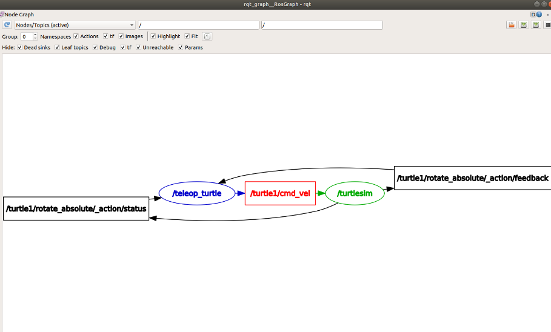

# TOPICOS

Como puedes ver en ros2 los componentes del sistema no interactúan mediante llamadas directas entre funciones, sino a través de un mecanismo de mensajería que permite mantener los módulos independientes y desacoplados. Una de las formas principales de comunicación es mediante Tópicos. 

Los topicos funcionan como un canal de datos con nombre: Un nodo puede publicar mensajes en él, y los otros nodos pueden "suscribirse" para recibir esos mensajes y gracias a esto los nodos no necesitan conocerse entre si ni nada solo se tienen que ponerse de acuerdo en el mismo Topico.

Esto es realmente util cuando se requiere un flujo continuo o periódico ded información. Cuando trabajas con simulaciones o robots reales, muchas veces el numero de nodos va a crecer junto con los topicos y en estos casos entender quien envia qué, quien escucha y como fluye la información es importante.

Y aquí es donde entra una herramienta grafica rqt (rqt_graph)

# RQT GRAPH

ESta permite visualizar el grafo ros: nodos como elementos, topicos como conexiones y desde un simple vistazo ver como se comunican entre si distintos modulos.
Este diagrama visual es muy valioso para comprender la arquitectura de tu sistema para depurar conexiones incorrectas, para documenttar tu robot, o simplemente para confirmar que los nodos estan comunicandose como esperas.

Acá una imagen de como se vería el rqt_graph con el turtlesim.node y turtle_teleop_key

    

