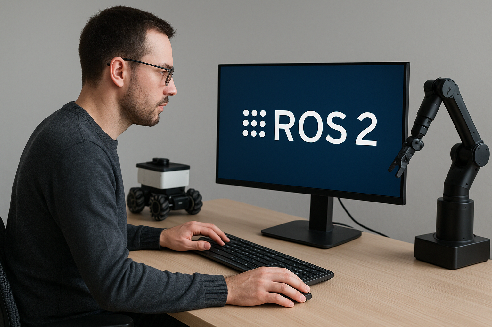

    

# 🚀 Guía de Instalación y Primeros Pasos con ROS 2 en Ubuntu

¡Bienvenido al emocionante mundo de la robótica! Este repositorio te guiará en los primeros pasos para configurar y trabajar con **ROS 2 (Robot Operating System 2)**, el sistema operativo de robots más utilizado en el mundo. Si alguna vez has soñado con crear un robot autónomo, ¡este es el lugar donde todo comienza!

## 🎯 ¿Qué es ROS 2?

**ROS 2** es un marco de software flexible para el desarrollo de aplicaciones robóticas. Permite integrar diversos componentes, como sensores, cámaras, actuadores y algoritmos, todo dentro de una arquitectura modular y escalable. ROS 2 es la evolución de ROS 1, mejorando aspectos clave como la seguridad, la comunicación y la compatibilidad con diferentes sistemas operativos, ¡lo que lo hace perfecto para proyectos avanzados!

### 🛠 Requisitos

Antes de comenzar con la instalación, asegúrate de tener los siguientes requisitos:

#### 🔧 **Hardware Requerido**:
- **Computadora con Ubuntu 24.04** (o superior) instalada.
- **Mínimo 4 GB de RAM** (se recomienda 8 GB para un mejor rendimiento).
- **Procesador de 64 bits** (se recomienda un procesador moderno de múltiples núcleos).
- **Conexión a Internet** para descargar las dependencias y herramientas.

#### 💻 **Software Requerido**:
- **Ubuntu 24.04** o superior (aunque también puede funcionar en otras distribuciones de Linux).
- **Git**: Para gestionar el código fuente.
- **Python 3**: ROS 2 depende de Python 3 para muchas de sus herramientas y bibliotecas.
- **Dependencias de ROS 2**: Incluirás las bibliotecas necesarias durante la instalación.
